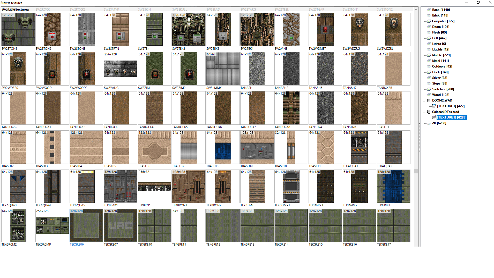
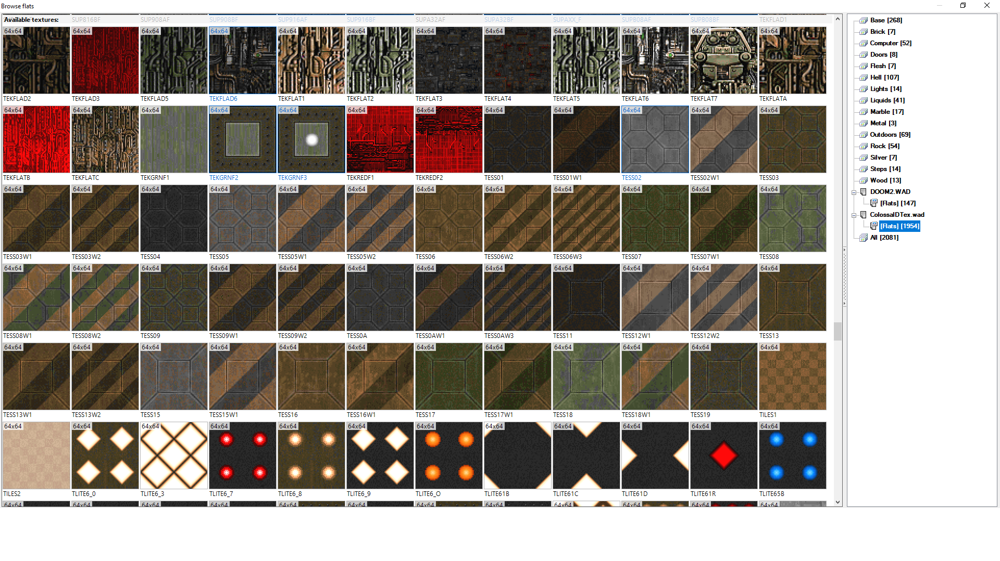
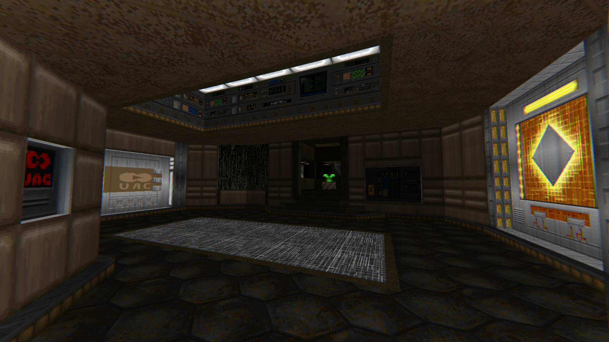
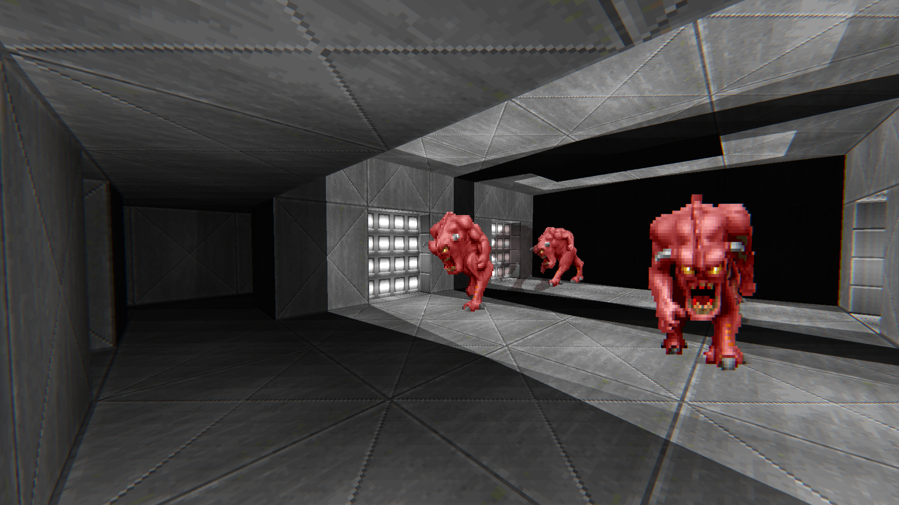
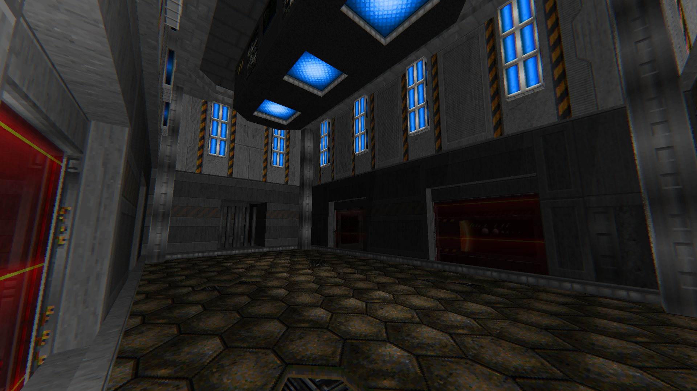
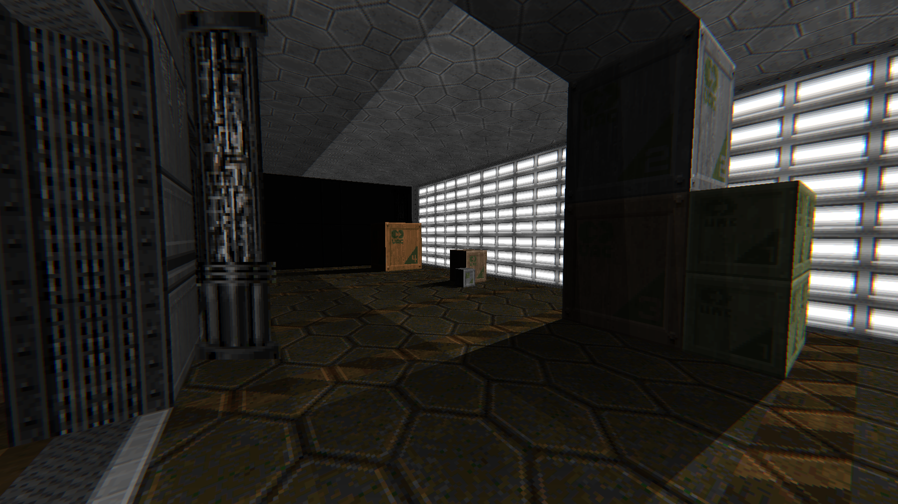
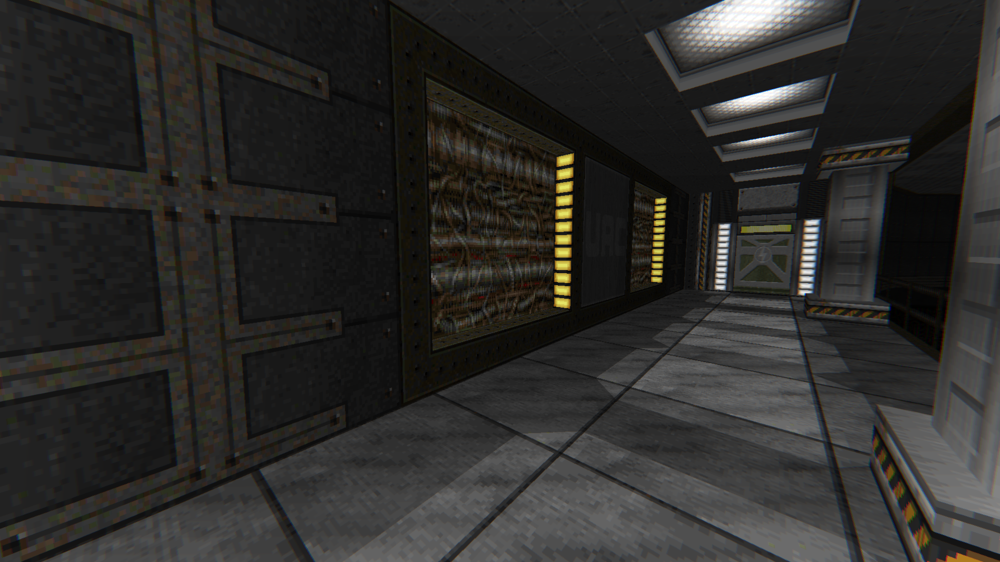

# ColossalDTex [BOOM+, 8200+ textures]

# STATUS: ✅RELEASED

Texture pack assembled by DRON12261.

Also, some textures have been changed and a few new ones have been added. 

There is full compatibility with the fluid system in Woof and Doom Retro.

### Download - [Latest Release](https://github.com/Doom-Mapping-Modding-Lair-DRON12261/RES-ColossalDTex/releases/latest/download/ColossalDTex_v1.wad)

This texturepack is assembled from:
- 32in24-15tex_v2.wad
- Resources from KDiKDiZD
- jimmytex.wad
- sstex.wad
- rfhelltx.wad

# Screenshots:

## Example from [MidNightmare](https://github.com/Doom-Mapping-Modding-Lair-DRON12261/WAD-MidNightmare):

